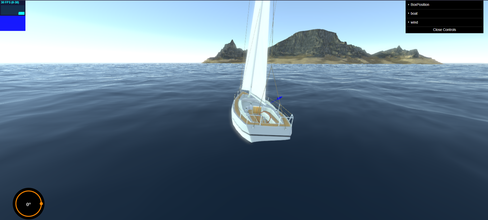
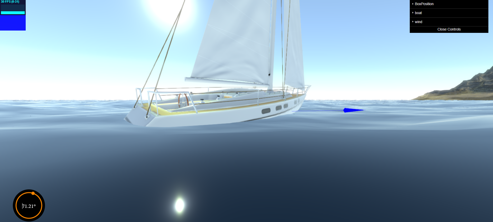
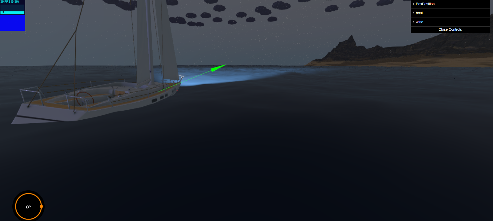
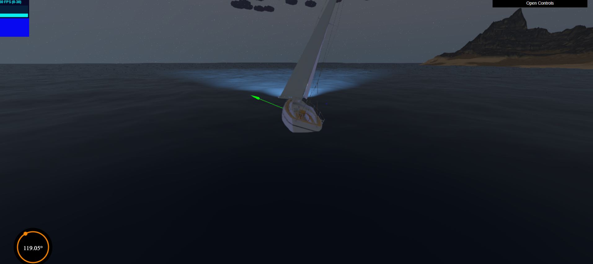

# Sail Boat physics Simulation
A Sailboat physics simulation made in three.js and Ape.ecs using a reusable abstracted approach!











## Features:
- physics simulation from scratch no physics engine in use
- Rigid Body physics that works with any 3D triangulated mesh
- ECS approach, (e.g :entities can have a rigid body component)
- Voxelization based Buoyancy simulation 
- Sum Of Sines water approximation using a vertex shader
- Sail Boat physics inc. lift & drag forces, buoyancy...
- Day and Night weather conditions


### Build:
first check if you have npm and install dependencies:<br/>
```sh
npm --version
npm install
```
the project can be built with the command: <br/>
```sh
npm run build
```
or run a development server using:
```sh
npm run dev
```

### Live Demo:

You can also Check out the live demo from here:<br/>


🔥 [Live Demo](https://threesails.onrender.com/) 🔥


#### TODO:
currently the project is missing some features:
- controls gui (currently actions are done using a lot of confusing keys)
- water reflections
- better way to handle drag
